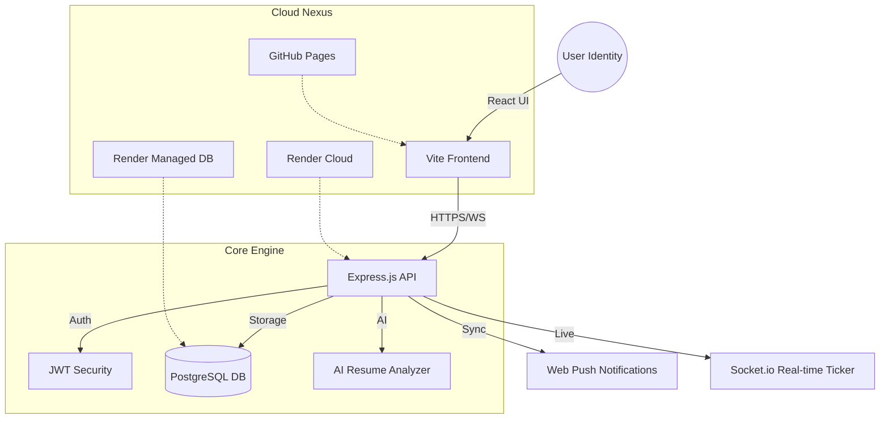

# ◈ AlumniConnect: The Nexus Registry ◈


**AlumniConnect** is a next-generation professional synchronization platform designed to bridge the temporal gap between students and alumni. It serves as a decentralized hub for mentorship, career opportunities, and institutional heritage, powered by a robust full-stack architecture and AI-driven insights.

---

## ◈ The Vision
In the modern academic ecosystem, the transition from student to professional is often fractured. **AlumniConnect** repairs this link by providing a secure, real-time environment where:
- **Alumni** can give back through mentorship and job postings.
- **Students** can navigate their career paths with guidance from those who walked them before.
- **Institutions** can maintain a living, breathing registry of their legacy.

---

## ◈ System Architecture



---

## ◈ Key Modules

| Module | Description |
| :--- | :--- |
| **Identity Management** | Role-based access control (RBAC) for Students, Alumni, and Admin. |
| **Opportunity Portal** | A specialized job board for institutional referrals and internships. |
| **Mentorship Hub** | Integrated scheduling and meeting coordination for career guidance. |
| **Nexus Ticker** | A live, real-time activity feed showing system-wide interactions. |
| **AI Resume Analyzer** | Automated professional feedback using Llama 3 LLMs. |
| **Time Capsules** | Temporal messages left by alumni for future generations. |

---

## ◈ Project Structure

```text
alumini-dbms/
├── .github/workflows/    # CI/CD Deployment Pipelines (GitHub Actions)
├── backend/              # Core Node.js / Express Server
│   ├── db/               # SQL Schemas, Seeds, and Pool Config
│   ├── routes/           # RESTful API Endpoints (Auth, Users, Jobs, etc.)
│   ├── middleware/       # Security, RBAC, and Auth Guards
│   ├── uploads/          # Local storage for avatars and resumes
│   └── server.js         # Nexus Entry Point
├── frontend/             # React / Vite Application
│   ├── public/           # Static assets and security files
│   ├── src/
│   │   ├── api/          # Axios client and network interceptors
│   │   ├── components/   # Atomic UI components
│   │   ├── pages/        # Dashboard, Registry, Profile layouts
│   │   └── App.jsx       # Routing Strategy (HashRouter)
│   └── vite.config.js    # Production Build Configuration
└── README.md             # The Nexus Manual
```

---

## ◈ Operational Guide

### 1. Prerequisites
- **Node.js** v20+
- **PostgreSQL** v14+
- **Vite** (for frontend builds)

### 2. Local Initialization
```bash
# 1. Clone the Registry
git clone https://github.com/hackerman567/alumini-dbms.git

# 2. Setup Backend
cd backend
npm install
# Configure .env with DATABASE_URL, JWT_SECRET

# 3. Setup Frontend
cd ../frontend
npm install
# Configure .env with VITE_API_URL
```

### 3. Database Synthesis
```bash
# From the backend folder
npm run seed
```

### 4. Deployment Pipeline
The project uses a professional **CI/CD pipeline** via GitHub Actions:
- **Build**: Vite compiles assets into `dist/`.
- **Deploy**: GitHub Actions pushes artifacts to the `gh-pages` branch.
- **Backend Sync**: Render auto-deploys the `backend` directory upon every push to `main`.

---

## ◈ Future Scope: The Evolution

The Nexus is designed for modular expansion:
1. **Neural Matching**: Upgrading the mentorship system with AI that matches students to alumni based on career trajectory patterns.
2. **Blockchain Verified Degrees**: Integrating NFTs/Blockchain to verify educational credentials directly on the profile.
3. **VR Alumni Hall**: A 3D virtual environment for annual meetups and webinars.
4. **Mobile Nexus**: Transitioning the core React logic into a Native mobile application for on-the-go notifications.

---

> **Registry Status**: Operational  
> **Maintainer**: Praveen Ramesh / hackerman567  
> **Last Sync**: May 2026

© 2026 AlumniConnect Nexus. All rights reserved.
